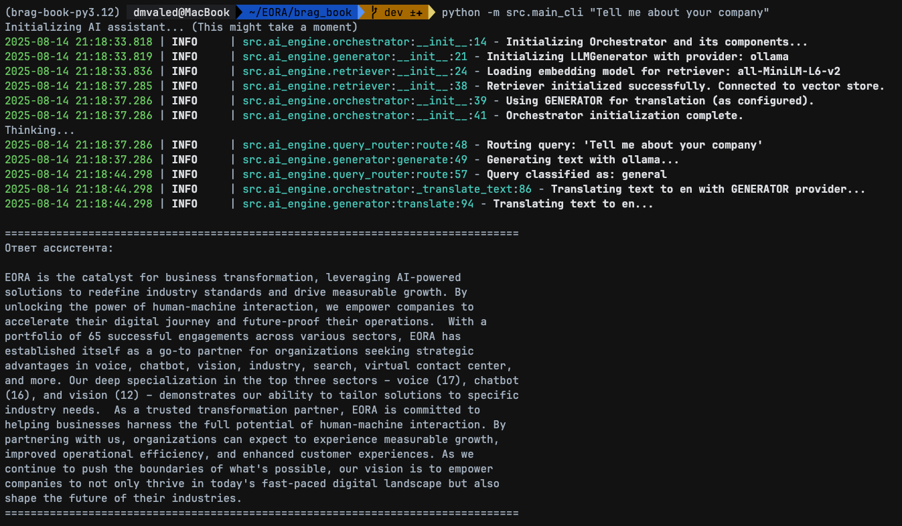
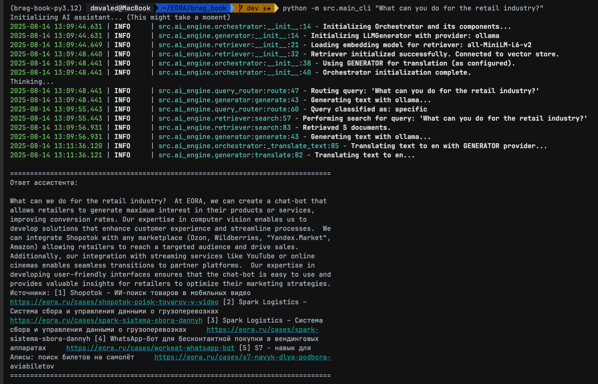
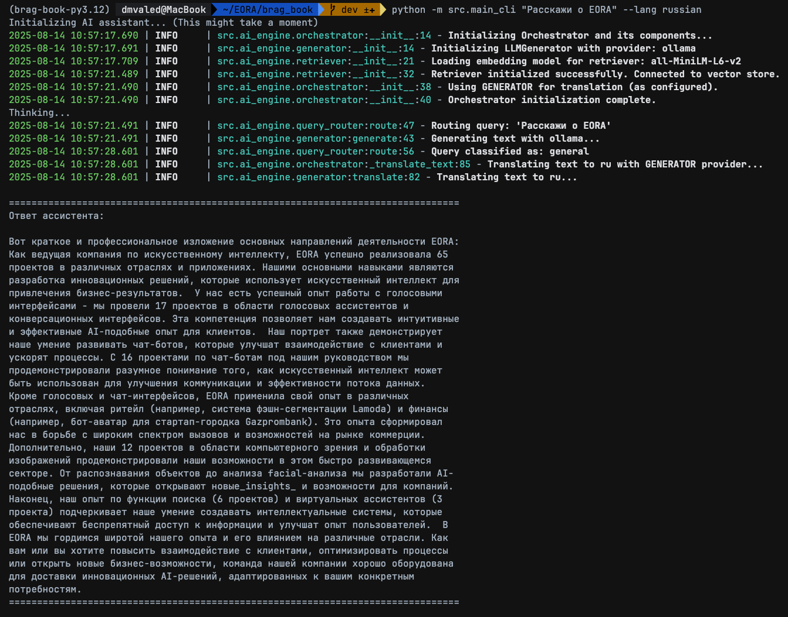
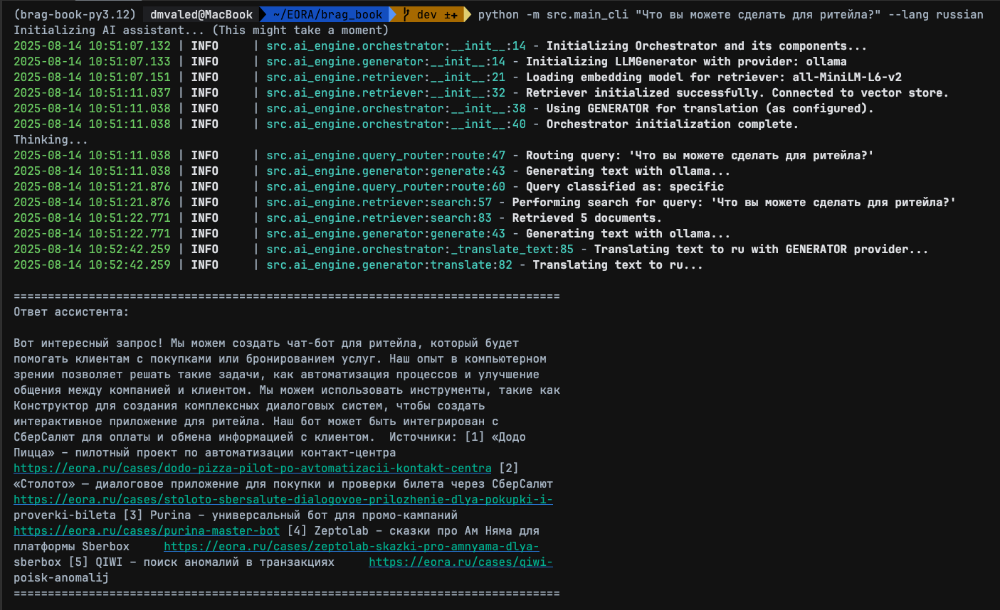

# EORA AI Brag Book Assistant


This project is an AI-powered Q&A service that acts as an intelligent assistant for the company EORA. It leverages a local Large Language Model (LLM) and a Retrieval-Augmented Generation (RAG) architecture to answer questions from potential clients about EORA's capabilities.

The assistant grounds its answers in the actual content of EORA's case studies, scraped from the official website (eora.ru), ensuring that all responses are factual, relevant, and supported by real-world examples.

## Key Features

- **Intelligent Q&A**: Can answer both general questions ("What does EORA do?") and specific, industry-related questions ("What can you do for a taxi company?").
- **Retrieval-Augmented Generation (RAG)**: Answers are not hallucinated. The system first retrieves relevant project information from a vector database and then uses an LLM to synthesize an answer based on that verified context.
- **Local First**: Primarily designed to run with local models via Ollama, ensuring privacy and zero API costs.
- **Fact-Based with Citations**: All answers for specific questions are generated with citations and a list of source URLs, linking back to the original case studies.
- **Multi-Language Support**: Capable of delivering final answers in multiple languages (e.g., Russian, English) using high-quality, specialized translation models.
- **Modular and Extensible**: The architecture is broken down into logical components (data preparation, AI engine), making it easy to maintain and extend.

## Technology Stack

The project is built with a modern Python stack, emphasizing modularity and performance.

| Component | Technology / Library      | Purpose |
|-----------|---------------------------|---------|
| Core Language | Python 3.12               | The primary programming language. |
| LLM Orchestration | Ollama                    | For serving and running local large language models like Llama3. |
| Web Scraping | httpx, BeautifulSoup4     | Asynchronously fetching and intelligently parsing HTML content from the case study pages. |
| Data Processing | pandas                    | For initial loading and analysis of the project list from the CSV. |
| Text Processing | langchain                 | Used for its robust text splitting utilities to chunk large documents. |
| Embeddings | sentence-transformers     | To convert text chunks into dense vector embeddings for semantic search. |
| Vector Database | ChromaDB                  | A local vector store to save and efficiently query text embeddings. |
| Translation | Hugging Face Transformers | For loading and using specialized, high-quality translation models (e.g., Helsinki-NLP). |
| CLI | argparse                  | For creating a user-friendly command-line interface. |
| Configuration | pydantic-settings         | For managing environment variables and secret keys securely.
| Data Validation | pydantic                  | For creating strict data models and ensuring data consistency throughout the application. |

## Project Structure

The repository follows a modular Python project structure with clear separation of concerns:

eora-ai-assistant/
├── data/ # All data artifacts
│ ├── raw/ # Original input data (CSV files)
│ ├── processed/ # Intermediate processed data
│ └── knowledge_base/ # Final vector database and embeddings
│
├── src/ # Source code directory
│ ├── ai_engine/ # Core AI components
│ │ ├── generator.py # LLM response generation
│ │ ├── retriever.py # Vector database queries
│ │ └── translator.py # Language translation
│ │
│ ├── core/ # Foundation code
│ │ ├── config.py # Configuration management
│ │ ├── models.py # Pydantic data models
│ │ └── logging.py # Logging setup
│ │
│ ├── preparation/ # Knowledge base setup scripts
│ │ ├── 01_scrape_and_enrich.py
│ │ ├── 02_generate_summary.py
│ │ └── 03_build_vector_store.py
│ │
│ └── main_cli.py # Command-line interface entry point
│
├── tests/ # Test suite
│ ├── unit/ # Unit tests
│ └── integration/ # Integration tests
│
├── .env # Environment variables
├── pyproject.toml # Project metadata and dependencies
├── requirements.txt # Development dependencies
└── README.md # Project documentation

### Directory Details:

1. **`data/`** - Contains all data-related files:
   - `raw/`: Initial input data (CSV files with project information)
   - `processed/`: Intermediate files during knowledge base creation
   - `knowledge_base/`: Final ChromaDB vector store and embeddings

2. **`src/`** - Main source code:
   - `ai_engine/`: Core AI functionality
     - `generator.py`: Handles LLM response generation
     - `retriever.py`: Manages vector database queries
     - `translator.py`: Handles multilingual responses
   - `core/`: Foundation components
     - `config.py`: Configuration management
     - `models.py`: Data validation models
     - `logging.py`: Logging configuration
   - `preparation/`: Knowledge base setup scripts (run once)

3. **Supporting Files**:
   - `.env`: Environment variables (API keys, paths)
   - `pyproject.toml`: Modern Python project configuration
   - `requirements.txt`: Python dependencies
   - `README.md`: Project documentation

This structure follows Python best practices with:
- Clear separation between data, source code, and tests
- Modular organization of AI components
- Proper isolation of configuration and environment variables
- Support for both development and production use cases

## Setup and Installation

### 1. Prerequisites

- Python 3.12
- Ollama installed and running on your system.

### 2. Clone the Repository

```bash
git clone https://github.com/valed-dm/brag_book.git
cd brag_book
```

### 3. Set Up Virtual Environment and Install Dependencies

This project uses Poetry to manage dependencies and virtual environments. The pyproject.toml file contains all the necessary project metadata and dependency information.
#### 3.1. Install Poetry

If you don't have Poetry installed, follow the official instructions on the Poetry website.
#### 3.2. Install Project Dependencies

Navigate to the project's root directory (where pyproject.toml is located) and run the following command.
Poetry will automatically create a virtual environment for the project and install all the required packages
defined in pyproject.toml.
 ```bash
 poetry install --no-root
 ```
This single command handles the creation of the virtual environment and the installation of all dependencies,
making the setup process clean and repeatable.

### 4. Download Local Models

Open a separate terminal and run the following commands to download the necessary models via Ollama.
```bash
ollama pull llama3
```

### 5. Prepare the Input Data

run data/eora_brag_scraper.py:
```bash
# This will take a few minutes due to the built-in delays
python -m data.eora_brag_scraper
python -m src.preparation.01_scrape_and_enrich
python -m src.preparation.02_generate_summary
python -m src.preparation.03_build_vector_store
```

### 6. Usage

You can now ask questions to the AI assistant from the command line. Make sure Ollama is running in the background.

**Basic Example**
```bash
python -m src.main_cli "Tell me about your company"
```
[]()
```bash
python -m src.main_cli "What can you do for the retail industry?"
```
[]()
```bash
python -m src.main_cli "Расскажи о EORA" --lang russian
```
[]()
```bash
python -m src.main_cli "Что вы можете сделать для ритейла?" --lang russian
```
[]()

## Future Improvements

This project has a solid foundation, but there are several ways it could be updated and improved in the future:

- Web Interface: Build a simple web interface (e.g., using Flask or FastAPI with a simple frontend) to make the assistant accessible to non-technical users.
- Automated Knowledge Base Updates: Create a scheduled job (e.g., a cron job) that periodically re-runs the preparation pipeline to keep the knowledge base in sync with the live website.
- Advanced Document Parsing: Instead of just extracting text, use a library like unstructured to parse PDFs or other document types, allowing the assistant to draw from a wider range of company materials.
- More Sophisticated Routing: For very complex applications, the QueryRouter could be enhanced to route to different, specialized RAG pipelines based on the query type (e.g., a "technical" pipeline vs. a "business" pipeline).
- Hybrid Search: Combine the current semantic (vector) search with traditional keyword-based search (e.g., BM25) to improve retrieval accuracy, especially for queries containing specific jargon or product names.
- Chat History and Context: Implement a conversational memory to allow for follow-up questions, making the interaction feel more like a true conversation.
